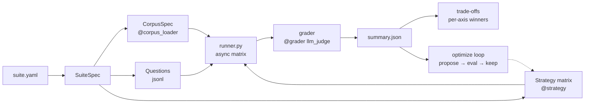

# xcbench: Context Curation Benchmark

[](https://github.com/yanhann10/context-curation-bench/actions/workflows/ci.yml)
[](https://www.python.org/)
[](LICENSE)

**xcbench** benchmarks LLM **context curation** — the set of choices made before the answering model runs: which documents to include, how to rank them, how to compress them, and what surrounding scaffolding to wrap around them. A suite is a *matrix* of strategies rather than a single target, and the output is a Pareto trade-off over `(quality, cost, latency)` rather than a pass/fail gate.

Strategies currently compared: `full_context`, `rag_embedding`, `hierarchical`, `agent_managed`, `cascade`, `ensemble`, `meta_harness`, and — in the mle-bench probe — `rerank_rag`, `compressed`, `thin_harness`.

## Quick start

```bash
python3 -m venv .venv && source .venv/bin/activate
pip install -r requirements.txt
cp .env.example .env          # edit ANTHROPIC_API_KEY
python -m xcbench demo
```

`demo` runs the bundled HR-policy suite end-to-end. ~2–3 min, artifacts in `output/`. After it finishes, open `output/sample-data-hr-policy_summary.json` for per-strategy aggregates and `output/sample-data-hr-policy_frontier.json` for the Pareto set.

## Results

Two suites are reported below at a size we're willing to stand behind (HR N=108, ConflictQA N=120). Polars and Flask suites exist in `suites/` but are not reported here — their N=10 question sets are too small to distinguish strategies, and every retrieval-tolerant strategy saturates at 1.000 on Polars. We treat sub-N=50 runs as developer-loop sanity checks, not results.

Each table normalizes cost and latency to the cheapest strategy on that suite (`× base`). "Base" is whichever strategy ran cheapest; it is not necessarily the best-quality one. A single seed is used across all runs (seed = question order + model temperature 0 + retrieval tie-break; re-running is deterministic up to backend sampling noise).

### HR Policy

**Source:** [GitLab Handbook](https://handbook.gitlab.com/handbook/) pages (`data/handbook/`) plus owner-validated operational updates (synthetic Slack threads, `data/slack.json`). Tests single-source lookup, source-specific updates, multi-source synthesis, and resolved conflicts.

| strategy       | quality   | cost (× base) | latency (× base) |
|----------------|----------:|--------------:|-----------------:|
| full_context   | **0.927** | 6.1×          | 1.2×             |
| rag_embedding  | 0.888     | 1.0× (base)   | 1.0× (base)      |
| meta_harness   | 0.866     | 3.8×          | 1.1×             |
| agent_managed  | 0.823     | 2.6×          | 2.5×             |

**Runs:** N=108 questions, single seed. Base strategy `rag_embedding` costs $1.15 and averages 13.5s per question. Bold = highest quality.

Three other strategies (`hierarchical`, `cascade`, `ensemble`) crashed mid-run on this matrix due to an instrumentation bug and are excluded rather than reported as zeros; they appear on the ConflictQA suite below. Failure-mode taxonomy: [`eval/forensics_hr.md`](eval/forensics_hr.md) — >50% of failures cluster on multi-doc synthesis where retrieval missed the second doc.

### ConflictQA

**Source:** [kortukov/ConflictingQA](https://huggingface.co/datasets/kortukov/ConflictingQA) on Hugging Face — synthesis over genuinely conflicting real web sources. No timestamp or authority signal is available to resolve disagreements, which is what makes it hard.

| strategy       | quality   | cost (× base) | latency (× base) |
|----------------|----------:|--------------:|-----------------:|
| full_context   | **0.876** | 2.6×          | 1.2×             |
| hierarchical   | 0.830     | 1.6×          | 1.6×             |
| agent_managed  | 0.811     | 2.5×          | 50.1×            |
| ensemble       | 0.641     | 3.5×          | 11.8×            |
| cascade        | 0.610     | 2.2×          | 4.4×             |
| rag_embedding  | 0.281     | 1.0× (base)   | 1.0× (base)      |

**Runs:** N=120 questions, 6 strategies, single seed. Base strategy `rag_embedding` costs $1.25 and averages 12.5s per question. Bold = highest quality.

Two observations: `rag_embedding` collapses because conflicting sources undermine the single-chunk-per-answer retrieval assumption; and `agent_managed` burns 50× the base latency on a task where the ceiling isn't obviously worth it. The former motivates the mle-bench `rerank_rag` probe below; the latter sharpens the cost-axis story in the frontier.

### Not reported

- **Polars** (`suites/polars_docs.yaml`) — N=10, saturated. Four strategies tie at 1.000 quality on the current question set. Not a discrimination test.
- **Flask** (`suites/flask_codebase.yaml`) — N=10, not yet run at scale. Held pending question-set expansion.

Both suites run via `python -m xcbench run suites/<file>.yaml` if you want them locally.

## Cross-domain probe: mle-bench harness ablation

Separate probe to test whether the harness ranking generalizes to code-generation tasks. Each harness produces a Python script that runs in the `mlebench-env` Docker container; a single revise-on-error round is allowed; the final `submission.csv` is graded via `mlebench grade-sample`. Agent model: `claude-sonnet-4-5` via Bedrock, temp 0.

| harness         | spooky (log loss ↓) | jigsaw (AUC ↑) | cost 2-comp |
|-----------------|--------------------:|---------------:|------------:|
| `full_context`  | 0.576               | 0.964          | $0.059      |
| `rag_embedding` | 0.487               | 0.964          | $0.031      |
| `hierarchical`  | **0.486**           | 0.964          | $0.046      |
| `agent_managed` | **0.486**           | 0.948          | $0.075      |
| `rerank_rag`    | 0.576               | 0.964          | $0.048      |
| `compressed`    | 0.490               | 0.948          | $0.064      |
| `thin_harness`  | 0.530               | **0.971**      | **$0.024**  |

**Runs:** N=2 competitions × 7 harnesses = 14 submissions, single seed, 12.5 min wall, $0.35 total Bedrock spend. Bold = best per column.

Three observations — two expected, one surprising:

- **Ranking is task-dependent** (reinforcing the prior 4-harness finding). On short-text 3-class author ID, less-context harnesses (hierarchical, agent_managed, rag_embedding, all ~0.486) beat `full_context` (0.576) by ~9 pp log loss. On long multi-label toxicity, four harnesses tie at 0.964 — the agent picks the same TF-IDF + LogReg family regardless of how much context it sees, and that family's ceiling on this corpus is ~0.964.
- **`thin_harness` was competitive or best on both tasks** — filenames + sample submission alone gave the agent enough to write a clean baseline. On jigsaw it was the only harness above the 4-way 0.964 tie (0.971). Removing context didn't hurt and in one case helped, which is itself a finding about how much of the scaffolding was load-bearing.
- **`rerank_rag` degenerated to `full_context` on spooky** (identical 0.576 score) because spooky's description is short enough to fall below the rerank_rag chunking floor (<3 chunks → full inclusion). A feature, not a bug — the fallback is explicit — but it means this competition doesn't exercise the reranker. A longer-description competition would.

None of the 14 cells hit Kaggle medals (spooky bronze = 0.294 log loss, jigsaw bronze = 0.986 AUC) — consistent with first-pass code without HPO or ensembling. The probe tests harness ranking, not leaderboard competitiveness.

Run yourself (Docker and Kaggle credentials required; see `mle_harness/`):

```bash
AWS_REGION=us-east-1 python -m mle_harness.run_matrix \
  --comps spooky-author-identification,jigsaw-toxic-comment-classification-challenge \
  --harnesses full_context,rag_embedding,hierarchical,agent_managed,rerank_rag,compressed,thin_harness \
  --out output/mle_matrix_7harness.csv
```

## Adaptive routing: the live question

On both reported suites, no single strategy Pareto-dominates. `full_context` wins quality and loses on cost; `rag_embedding` wins cost and loses on quality wherever synthesis is needed. The interesting question is whether a per-question router can pick the right strategy from a cheap signal over the question text.

The current `cascade` strategy approximates this via self-verification (tier-1 `hierarchical` → verifier → tier-2 `agent_managed` → verifier → tier-3 `full_context`). It underperforms: self-verification over-fires on easy questions *and* misses confidently-wrong tier-1 outputs. The failure mode is in [`eval/forensics_hr.md`](eval/forensics_hr.md). A cross-model verifier, a classifier trained on labelled routings, or an Adaptive-RAG-style query-type router (see "Potentially worth testing next" below) are the concrete next steps.

## Limitations

Things we are deliberately *not* claiming:

- **Single seed, no confidence intervals.** Numbers are point estimates; small quality gaps on HR (0.927 vs 0.888, N=108) are not tested for significance. Treat rankings as directional until a re-run with bootstrapped CIs lands.
- **Agent and judge share a model family** on the default config (both default to `claude-opus-4-7`), which risks self-preference bias. The runner prints a warning when this happens. Override `JUDGE_MODEL` in `.env` (e.g. to `claude-haiku-4-5`) to differ.
- **No label leakage by construction, not by test.** Adjudication metadata (`authority_rule_used`, `canonical_source_ids`, `adjudication_rationale`) is stored in the question schema but never included in the judge payload — see [`xcbench/_internal/evaluator_async.py:30-37`](xcbench/_internal/evaluator_async.py) for the exact payload the judge sees. There is currently no regression test that asserts this; grep is the audit.
- **Cost-accounting** in cascade / ensemble / meta_harness **sums all sub-calls**, including verifier and optimizer-train calls on meta_harness. The quoted × base is end-to-end spend on the test split; it is not per-answering-call.
- **No closed-book baseline.** We don't currently report a "model answers without any context" floor. Until that exists, take absolute quality numbers as relative-to-each-other, not relative-to-a-known-floor.
- **Three HR strategies excluded** from the HR table due to a runtime bug that zeroed their outputs (`hierarchical`, `cascade`, `ensemble`). They do run on ConflictQA; the bug is run-specific, not strategy-fundamental.

## Architecture



Four things xcbench does differently from a typical evals harness (shape borrowed from [letta-evals](https://github.com/letta-ai/letta-evals), novelties are ours):

1. **`strategies:` is a list** — a suite IS a matrix, not a single `target:`.
2. **`CorpusSpec` is first-class**, separate from dataset. Docs carry source metadata (`kind`, `timestamp`, `issuer`, `scope`). Questions carry adjudication metadata (`gold_status`, `canonical_source_ids`, `authority_rule_used`) without leaking that rationale into the judge prompt.
3. **`frontier:` replaces `gate:`** — output is per-axis winners over `(quality, cost, latency)` plus a trade-off summary, instead of a boolean pass/fail threshold.
4. **`optimize:` is a built-in phase** — propose → evaluate → keep-best on a typed `CurationSpec` runs before final scoring.

## Add your own strategy

xcbench is a decorator-registry. A new strategy / corpus loader / grader is ~10 lines:

```python
from xcbench.registry import strategy

@strategy("keyword_filter")
async def keyword_filter(ctx, question, corpus, terms=None):
    picks = [d for d in corpus.docs if any(t in d.title.lower() for t in terms or [])]
    blob = "\n\n".join(f"# {d.title}\n{d.content}" for d in picks)
    return f"Context:\n{blob}\n\nQuestion: {question.input}"
```

Full walkthrough: [`docs/add_your_own.md`](docs/add_your_own.md). Minimal 3-doc / 2-question example: [`examples/toy/`](examples/toy/).

## Run

```bash
# bundled HR-policy suite end-to-end
python -m xcbench demo

# run any suite YAML
python -m xcbench run suites/sample_data_hr_policy.yaml
python -m xcbench run suites/conflictqa.yaml --strategies full_context,rag_embedding,hierarchical --skip-optimize

# dev-loop-only suites (N=10 — not reported in this README)
python -m xcbench run suites/polars_docs.yaml
python -m xcbench run suites/flask_codebase.yaml

# minimal 3-doc / 2-question example
python -m xcbench run examples/toy/suite.yaml
```

Artifacts in `output/` (per-suite prefixed):
- `{suite}_matrix.csv` — per-question × per-strategy row (quality, f1, EM, tokens, latency, cost)
- `{suite}_summary.json` — per-strategy aggregate means
- `{suite}_frontier.json` — Pareto non-dominated set + per-axis winners
- `{suite}_optimizer_history.json` — proposed spec + rationale + score per iteration

The `{suite}` prefix is the `name:` field inside the suite YAML (e.g. `sample-data-hr-policy_matrix.csv`), which may differ from the YAML filename.

## Repo layout

```
xcbench/
├── cli.py              # python -m xcbench demo|run|validate|list-strategies
├── registry.py         # @strategy / @grader / @corpus_loader decorators
├── spec.py             # YAML → SuiteSpec
├── corpus.py           # CorpusSpec, Doc + source metadata
├── dataset.py          # Question
├── runner.py           # async matrix + per-category summary
├── judge.py            # llm_judge grader
├── frontier.py         # trade-off summary
├── optimizer.py        # built-in propose/eval/keep loop
└── strategies/         # full_context, rag_embedding, hierarchical, agent_managed, cascade, ensemble, meta_harness
suites/{sample_data_hr_policy,polars_docs,flask_codebase,conflictqa}.yaml
data/{handbook,polars,flask,conflictqa}/
mle_harness/            # cross-domain code-gen probe (full_context, rag_embedding, hierarchical, agent_managed, rerank_rag, compressed, thin_harness)
examples/toy/{corpus.jsonl,questions.jsonl,suite.yaml}
eval/{forensics_hr,forensics_polars,eval_runs}.md
```

To add a strategy, drop a new file in `xcbench/strategies/` and register it with the `@strategy` decorator (see "Add your own strategy" above, or [`docs/add_your_own.md`](docs/add_your_own.md) for the walkthrough). mle-bench harnesses live separately in `mle_harness/harnesses.py` because they operate on whole-task scaffolding, not per-question document selection.

## Metrics

| Metric | Range | Definition |
|---|---|---|
| quality | 0–1 | LLM-judge vs golden answer (or acceptable abstention behavior on ambiguous items when such labels exist) |
| f1 | 0–1 | SQuAD-style token F1 vs golden |
| exact_match | 0/1 | Normalized EM vs golden |
| key_fact_recall | 0–1 | Fraction of key_facts whose normalized form appears in answer |
| latency_s | float | Wall-clock seconds per agent call |
| prompt_tokens / completion_tokens | int | From Anthropic usage |
| cost_usd | float | Per-model priced, sum of agent + judge calls |

## Question categories

- `single_source` — one linked source is sufficient
- `source_only` — only a source-specific update thread answers the question
- `multi_source` — the answer requires synthesis across linked sources
- `scoped` — the correct answer is conditional on an explicit scope or version boundary
- `resolved_conflict` — linked sources disagree and the dataset carries explicit adjudication metadata for the winning resolution
- `abstain_required` — linked sources are insufficient or genuinely underdetermined, so the gold behavior is to say so

## Model configuration

```yaml
# any suite.yaml
models:
  agent: claude-opus-4-7       # answerer — dominant cost
  judge: claude-opus-4-7       # LLM-as-judge; override to claude-haiku-4-5 to differ from agent
  proposer: claude-opus-4-7    # meta-harness spec mutator
```

The runner warns if agent and judge are the same model (self-preference bias). Override the judge to `claude-haiku-4-5` to differ at the cost of weaker judgment, or override the agent to `claude-haiku-4-5` to push costs down at the cost of quality.

**Embeddings:** local `BAAI/bge-small-en-v1.5` via `sentence-transformers`. FAISS `IndexFlatIP` for retrieval.

## Strategies (with per-suite observations)

Observations below are from the HR N=108 and ConflictQA N=120 runs in the Results section.

- **`full_context`** — stuff every doc into the prompt. No selection.
  *Observation:* highest quality on both reported suites (0.927 HR, 0.876 ConflictQA), at 2.6–6.1× base cost. When conflicts or synthesis dominate, paying for the full context wins.

- **`rag_embedding`** — chunk docs (~1200 chars, 200 overlap), embed via `BAAI/bge-small-en-v1.5`, index in FAISS (`IndexFlatIP` on L2-normalized vectors = cosine), retrieve top-k per question. Classic RAG.
  *Observation:* cheap-and-fine on HR (0.888 q, base cost) but collapses on ConflictQA (0.281 q) — a single retrieved chunk can't represent a genuine disagreement between sources. Motivates the `rerank_rag` mle-bench probe.

- **`hierarchical`** — **no embedding retrieval.** Two LLM passes: (1) *map* — summarize each doc to 1–2 sentences once, cache; (2) *route* — LLM sees question + catalog of `(id, title, timestamp, summary)` and returns JSON `{"doc_ids": [...]}` with 2–5 picks; (3) *expand* — the full text of the selected docs goes to the answerer.
  *Observation:* 0.830 q on ConflictQA at 1.6× base cost — strongest value-per-dollar among non-full_context strategies. Excluded from HR table (runtime bug on that matrix).

- **`agent_managed`** — tool-use loop. The model gets tools to list and fetch docs, runs up to 6 turns. Token usage is summed across all turns.
  *Observation:* third on HR (0.823 q, 2.6× cost). Matches hierarchical on ConflictQA quality but at **50× the latency** because the tool-use loop doesn't short-circuit when retrieval is already sufficient.

- **`cascade`** — Tier 1 `hierarchical` → self-verifier (`{"confident": 0|1}`) → if 0, Tier 2 `agent_managed` → verifier again → if 0, Tier 3 `full_context`. Costs summed across all tiers executed.
  *Observation:* 0.610 q on ConflictQA at 2.2× base cost. The self-verifier over-fires on easy questions and misses confidently-wrong tier-1 outputs — see HR forensics doc.

- **`ensemble`** — `hierarchical` and `agent_managed` in parallel per question; judge-LLM picks A or B on correctness + specificity.
  *Observation:* 0.641 q on ConflictQA at 3.5× base cost. Worse than either component alone on this suite — judge disagrees with itself.

- **`meta_harness`** — applies a typed `CurationSpec` (which ids to include, ordering, format, max-chars, instructions) that an LLM proposer iteratively mutates against failure traces on a train subset. Simplification of Stanford IRIS's Meta-Harness (the faithful framework evolves arbitrary Python code; see [`notes/meta_harness_analysis.md`](notes/meta_harness_analysis.md)).
  *Observation:* 0.866 q on HR at 3.8× base cost — third overall. Train-split overfit is visible on small-N suites: the optimizer sometimes excludes a doc needed by a held-out question.

### mle-bench-only harnesses

Three additional strategies exist only in the cross-domain code-gen probe below (`mle_harness/harnesses.py`). They operate on whole-task scaffolding rather than per-question document selection:

- **`rerank_rag`** — chunks the competition description, LLM scores each chunk 0–10 for task-relevance, keeps top-5 by rank, re-sorts by original order for coherence.
- **`compressed`** — LLM compresses the description to ~50% length, preserving metric / target / format / input columns; drops motivation and history.
- **`thin_harness`** — file list + sample submission only, no description. Ablation floor — tests how much the model can infer from filenames.

## Potentially worth testing next

From a 2024–2026 literature pass, ranked by cheapest-to-implement that would diagnose a known xcbench weakness. Each is distinct from the strategies already implemented above.

1. **Cross-encoder reranker** — over-retrieve `k=40` with `bge-small`, then cross-encoder rerank to top-6 via [`BAAI/bge-reranker-v2-m3`](https://huggingface.co/BAAI/bge-reranker-v2-m3). The mle-bench `rerank_rag` harness uses LLM-scoring as a proxy; a cross-encoder is the proper retrieval-side version and is the cheapest test of whether `rag_embedding`'s HR-failure (missing the second doc) is reranker-limited. ~50 LOC.
2. **Contextual Retrieval** ([Anthropic, Sep 2024](https://www.anthropic.com/news/contextual-retrieval)) — prepend an LLM-generated 50–100 token chunk-context blurb before embedding and BM25. 35%/49% retrieval-failure reduction in the original post. Targets Polars/Flask where chunks lose parent-scope. ~100 LOC.
3. **Adaptive-RAG** ([Jeong et al., NAACL 2024, arXiv:2403.14403](https://arxiv.org/abs/2403.14403)) — T5-Large classifier routes `{no-retrieve, single-step, multi-step}` per query on auto-derived labels. Canonical learned-router paper; directly replaces hand-coded cascade escalation. Repo: [starsuzi/Adaptive-RAG](https://github.com/starsuzi/Adaptive-RAG). ~150 LOC.
4. **RAPTOR** ([Sarthi et al., ICLR 2024, arXiv:2401.18059](https://arxiv.org/abs/2401.18059)) — recursive GMM-cluster + summarize chunks into a multi-level tree; retrieve at any level. Real upgrade to the single-level `hierarchical`. ~200 LOC.
5. **LongLLMLingua / LLMLingua-2** ([arXiv:2310.06839](https://arxiv.org/abs/2310.06839), [arXiv:2403.12968](https://arxiv.org/abs/2403.12968)) — token-importance classifier drops low-score tokens conditioned on the query. Proper version of the LLM-as-compressor `compressed` mle-bench harness; reshapes `full_context`'s Pareto frontier rather than replacing it. ~70 LOC.
6. **GraphRAG** ([Microsoft, arXiv:2404.16130](https://arxiv.org/abs/2404.16130)) / **LightRAG** ([HKU, arXiv:2410.05779](https://arxiv.org/abs/2410.05779)) — entity KG + community summaries. Handles query-focused summarization ("what are the main themes of…") which none of the strategies above do well. ~150–200 LOC.
7. **CRAG — Corrective RAG** ([Yan et al., arXiv:2401.15884](https://arxiv.org/abs/2401.15884)) — T5 retrieval *evaluator* (not the LLM itself) grades retrievals and triggers web-fallback or decompose. Sidesteps the `cascade` self-verification pathology. ~120 LOC.
8. **HyDE** ([Gao et al., ACL 2023, arXiv:2212.10496](https://arxiv.org/abs/2212.10496)) — LLM drafts a fake answer; embed the answer, not the query. Likely helps on HR ("what's our policy on…") and hurts on Polars (hallucinated API names mislead retrieval). ~30 LOC.
9. **Self-RAG** ([Asai et al., ICLR 2024, arXiv:2310.11511](https://arxiv.org/abs/2310.11511)) — model emits `[Retrieve] / [IsRel] / [IsSup] / [IsUse]` reflection tokens; retrieval gated per sentence. Differs from `agent_managed` in granularity. Pretrained 7B/13B checkpoints exist. ~100 LOC.

**On learned per-query routing**, three recent papers directly study it: Adaptive-RAG (above), [RAGRouter / RAGRouter-Bench (arXiv:2505.23052)](https://arxiv.org/abs/2505.23052), and [RouteRAG (arXiv:2506.15862)](https://arxiv.org/abs/2506.15862). All report that per-query routing beats fixed-strategy baselines on heterogeneous question sets — directly relevant to the cascade-failure pattern documented in the HR forensics doc.

## References & upstream codebases

- **Meta-Harness** (Stanford IRIS Lab, 2026) — search over harness code via an LLM proposer. Paper: https://yoonholee.com/meta-harness/. Framework: https://github.com/stanford-iris-lab/meta-harness. Final tbench2 artifact: https://github.com/stanford-iris-lab/meta-harness-tbench2-artifact.
- **letta-evals** — evals harness shape that inspired xcbench's strategy-matrix suite format. https://github.com/letta-ai/letta-evals.
- **mle-bench** — OpenAI ML-engineering benchmark used for the cross-domain probe. https://github.com/openai/mle-bench.
- **GitLab Handbook** — source corpus for HR Policy suite. https://handbook.gitlab.com/handbook/.
- **Polars user guide** — source corpus for Polars Docs suite. https://docs.pola.rs/.
- **Flask docs** — source corpus for Flask Codebase suite. https://flask.palletsprojects.com/.
- **ConflictingQA** (kortukov, Hugging Face) — source dataset for ConflictQA sidecar. https://huggingface.co/datasets/kortukov/ConflictingQA.
