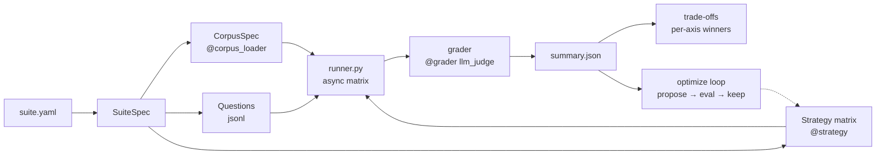

# xcbench: Context Curation Benchmark

[](https://github.com/yanhann10/context-curation-bench/actions/workflows/ci.yml)
[](https://www.python.org/)
[](LICENSE)
[](https://www.anthropic.com/)

**Status: work in progress.** Historical single-seed N=108 runs are kept as a legacy track, but the current schema treats context arbitration as broader than freshness. Answers may come from a single authoritative source, a source-specific operational update, multi-source synthesis, a scoped conditional resolution, or an explicit abstain/ambiguity label when the corpus does not support a single factual answer. No confidence intervals or multi-seed bootstrap are reported yet, so all aggregate numbers remain directional rather than significance claims.

A YAML-driven benchmark for LLM context-curation strategies: full-context, RAG, hierarchical, agent-managed, cascade-router, ensemble, and meta-harness-optimized. Each strategy answers the same question set over the same corpus, but the bundled suites vary the arbitration problem: direct lookup, source-specific updates, multi-source synthesis, resolved conflicts, and abstention-capable items with adjudicated gold behavior. Results are reported as a trade-off table over quality, cost, latency, and tokens rather than a single headline metric.

### Historical N=108 results (Claude Sonnet 4.5, AWS Bedrock)

Latency and token cost are both reported relative to the cheapest and fastest strategy (`rag_embedding` = 1×), computed from per-question means.

| strategy       | quality   | latency (× rag) | token cost |
|----------------|----------:|----------------:|-----------:|
| full_context   | **0.927** | 1.2×            | 9.3× |
| rag_embedding  | 0.888     | **1.0×**        | **1.0×** |
| meta_harness   | 0.866     | 1.1×            | 5.4× |
| agent_managed  | 0.823     | 2.5×            | 3.5× |

`rag_embedding` reaches 96 percent of `full_context` accuracy at roughly 11 percent of the token cost. This table comes from the older HR handbook-vs-update framing; treat it as historical context, not as the definition of the benchmark going forward. Per-strategy failure analysis is in [Findings ↓](#findings).

## Quick start

```bash
python3 -m venv .venv
.venv/bin/pip install -r requirements.txt
cp .env.example .env          # edit ANTHROPIC_API_KEY
.venv/bin/python -m xcbench demo
```

`demo` runs the bundled HR-policy suite end-to-end (7 strategies × 10 questions, LLM-judged, plus the meta-harness optimize loop). ~2–3 min, artifacts in `output/`.

### Illustrative output

The block below mocks up the `xcbench demo` terminal output. Per-strategy numbers (quality, f1, tokens, cost ×hier, latency ×hier) are derived from the committed HR run (`output/summary_hr.json`, N=10 HR-policy questions, Sonnet 4.6 + Opus 4.7 judge); the surrounding wrapper lines (progress messages, phrasing, exact column widths) are indicative, not a captured transcript. Run it yourself to see the real output.

```text
suite=sample-data-hr-policy  corpus=21 docs  questions=10
strategies=['full_context','rag_embedding','hierarchical','agent_managed','cascade','ensemble','meta_harness']

[optimize] fitting 'meta_harness' on 4 questions, 3 iterations
[optimize] final spec: 11 static docs + 10 slack threads, order=by-slice

[matrix] running 7 × 10 cells
========================================================================
SUITE SUMMARY — sample-data-hr-policy
========================================================================
strategy                 quality    f1   tokens  cost(×hier)  latency(×hier)
full_context               0.995 0.534   20231        5.7×            1.1×
rag_embedding              0.925 0.455    2459        1.2×            1.1×
hierarchical               0.910 0.491    1775        1.0×            1.0×
agent_managed              0.990 0.524    8142        2.7×            1.5×
cascade_router             0.925 0.546   24920        7.7×            3.9×
ensemble                   0.995 0.527   10219        3.6×            1.9×
meta_harness_optimized     0.890 0.467   12154        3.6×            1.2×

Per-axis winners:
       quality: ensemble
          cost: hierarchical
       latency: hierarchical
        tokens: hierarchical
```

### Charts — Polars eval (9 strategies × 10 questions)

| | |
|---|---|
|  |  |
| Quality by strategy (left); cost vs prompt-tokens on log-x (right) | 9 strategies × 10 questions, RdYlGn — thick_harness lights up the one 0.10 cell |

Both images are the real `chart_polars.png` and `chart_polars_heatmap.png` from `output/` after running on AWS Bedrock claude-sonnet-4-6. Full forensic analysis in [`eval/forensics_polars.md`](eval/forensics_polars.md).

## Honest framing: what this is and isn't

**This is not a faithful Meta-Harness port.** [Meta-Harness (Stanford IRIS Lab, 2025)](https://yoonholee.com/meta-harness/) evolves *arbitrary Python harness code* using execution traces and a Claude Code subprocess as the proposer. Faithful integration is 8–16 hrs of setup — out of scope here.

What this project ships instead: a **deliberate simplification** of the propose → evaluate → keep-best loop, applied to a **typed `CurationSpec` dataclass** (which docs to include, ordering, format, max-chars, instructions) rather than free-form code. Same loop shape, safer to execute, fully interpretable. See [`notes/meta_harness_analysis.md`](notes/meta_harness_analysis.md) for the integration-difficulty breakdown.

**What this project is good for:** a reproducible context-curation eval harness with a trade-off summary, 9 pre-built strategies (full, RAG, hierarchical, agent-managed, thin/thick harness axis, cascade, ensemble, meta-harness-optimized), and a way to compare how they handle direct lookup, source-specific updates, multi-source synthesis, resolved conflicts, and abstention-capable items where gold is explicitly adjudicated.

**Domains:** current bundled suites plus one experimental sidecar track:
- **HR Policy** (`suites/sample_data_hr_policy.yaml`) — handbook pages plus owner-validated operational updates. Long policy docs with `single_source`, `source_only`, `multi_source`, and `resolved_conflict` questions.
- **Polars Docs** (`suites/polars_docs.yaml`) — reference docs plus maintainer GitHub discussions. Short API docs, migration questions, and maintainer arbitration over current names and patterns.
- **Flask Codebase** (`suites/flask_codebase.yaml`) — Flask 2.x docs plus Flask 3.x maintainer discussions. Real breaking changes: removed APIs, replaced patterns, deprecated extensions.
- **ConflictQA** (`suites/conflictqa.yaml`) — experimental synthesis-heavy sidecar track based on real conflicting public sources. Useful for stress-testing synthesis behavior, but not the benchmark definition on its own.

**What it's not:** a production benchmark at N≥200 with multi-seed bootstrap CIs. The N=10 cells report a direction, not a significance claim. "Cell resolution is 0.10" refers to the per-question × per-strategy granularity imposed by N=10 — a single question flipping between 1.00 and 0.00 moves the per-strategy mean by 0.10, so any between-strategy delta under ±0.05 is inside noise. It is not a judge-side discretization or a reporting round. See `eval/eval_runs.md` → "From the HR run to a real benchmark" for what's missing.

## Architecture



Four things xcbench does differently from a typical evals harness (shape borrowed from [letta-evals](https://github.com/letta-ai/letta-evals), novelties are ours):

1. **`strategies:` is a list** — a suite IS a matrix, not a single `target:`.
2. **`CorpusSpec` is first-class**, separate from dataset. Docs can carry source metadata such as `kind`, `timestamp`, `issuer`, `scope`, or other loader-specific hints. Questions can now carry adjudication metadata (`gold_status`, `canonical_source_ids`, `authority_rule_used`, optional abstain behavior) without leaking that rationale into the judge prompt.
3. **`frontier:` replaces `gate:`** — output is per-axis winners over `(quality, cost, tokens)` plus a trade-off summary, instead of a boolean pass/fail threshold.
4. **`optimize:` is a built-in phase** — propose → evaluate → keep-best on a typed `CurationSpec` runs before final scoring.

## Add your own strategy

xcbench is a decorator-registry. A new strategy / corpus loader / grader is ~10 lines:

```python
from xcbench.registry import strategy

@strategy("keyword_filter")
async def keyword_filter(ctx, question, corpus, terms=None):
    picks = [d for d in corpus.docs if any(t in d.title.lower() for t in terms or [])]
    blob = "\n\n".join(f"# {d.title}\n{d.content}" for d in picks)
    return f"Context:\n{blob}\n\nQuestion: {question.input}"
```

Full walkthrough: [`docs/add_your_own.md`](docs/add_your_own.md). Minimal 3-doc / 2-question example: [`examples/toy/`](examples/toy/).

## Repo layout

```
xcbench/
├── cli.py              # python -m xcbench demo|run|validate|list-strategies
├── registry.py         # @strategy / @grader / @corpus_loader decorators
├── spec.py             # YAML → SuiteSpec
├── corpus.py           # CorpusSpec, Doc + source metadata
├── dataset.py          # Question
├── runner.py           # async matrix + per-category summary
├── judge.py            # llm_judge grader
├── frontier.py         # trade-off summary
├── optimizer.py        # built-in propose/eval/keep loop
└── strategies/         # full_context, rag_embedding, hierarchical, agent_managed, meta_harness
suites/sample_data_hr_policy.yaml
examples/toy/{corpus.jsonl,questions.jsonl,suite.yaml}
data/corpus.jsonl, questions.jsonl
```

Artifacts from any run: `output/{suite}_matrix.csv`, `{suite}_summary.json`, `{suite}_frontier.json`, `{suite}_optimizer_history.json`, `{suite}_runmeta.json`.

`main.py` is a shim that points at `python -m xcbench demo`; `xcbench` makes the pipeline a declarative suite, and the existing `src/` code is reused as strategy adapters — no rewrite.

## Thesis

"Just stuff the full context window" is the default assumption as windows expand. But when a corpus mixes heterogeneous sources — reference docs, maintainer discussions, owner-validated updates, and multi-source synthesis cases — does that default still win? And can a Meta-Harness-style proposer auto-discover a better curation strategy?

## Honest simplification from faithful Meta-Harness

Faithful Meta-Harness ([Stanford IRIS Lab](https://yoonholee.com/meta-harness/), [artifact](https://github.com/stanford-iris-lab/meta-harness-tbench2-artifact)) evolves **arbitrary Python harness code** using execution traces + filesystem. For a 2hr budget we:

- replace "mutate Python code" with "mutate a typed `CurationSpec` dataclass" — same loop (propose → execute → score → keep best), safer, interpretable
- use a single proposer LLM call per iteration instead of a population-based search
- train on a subset of the eval questions (no held-out split in MVP)

What we can legitimately claim: *"inspired by Meta-Harness; applies the propose/evaluate/keep loop to a structured curation spec rather than harness code."* Not a faithful reproduction. See `notes/meta_harness_analysis.md`.

## Repo layout

```
.
├── main.py                  # redirect shim → `python -m xcbench demo`
├── src/
│   ├── data_loader.py       # load handbook/*.md + slack.json + test_questions.json
│   ├── strategies.py        # full_context + meta_harness_optimized + CurationSpec
│   ├── evaluator.py         # agent call, LLM-as-judge, CSV logging
│   └── harness_optimizer.py # propose-mutate-score loop over CurationSpec
├── data/
│   ├── handbook/            # *.md extracted from handbook.gitlab.com
│   ├── slack.json           # synthetic Slack threads
│   └── test_questions.json  # 6 Qs w/ golden answers + category tags
├── output/                  # CSV + JSON artifacts from each run
├── eval/eval_runs.md        # append-only master log across runs
├── notes/
│   └── meta_harness_analysis.md
└── prd.md
```

## Setup

```bash
cd /Users/hanyan/git_repo/context-curation-bench
python3 -m venv .venv
.venv/bin/pip install -r requirements.txt
cp .env.example .env     # then edit ANTHROPIC_API_KEY
```

**LLM backend:** Claude (Anthropic SDK). Default models — agent = `claude-sonnet-4-6`, judge / proposer = `claude-opus-4-7`, summary / router = `claude-haiku-4-5`. Override via env.

**Embeddings:** local `BAAI/bge-small-en-v1.5` via `sentence-transformers` (Claude has no embedding endpoint). FAISS `IndexFlatIP` for retrieval.

## Run

```bash
# bundled HR-policy suite end-to-end
.venv/bin/python -m xcbench demo

# run any suite YAML
.venv/bin/python -m xcbench run suites/sample_data_hr_policy.yaml
.venv/bin/python -m xcbench run suites/polars_docs.yaml
.venv/bin/python -m xcbench run suites/conflictqa.yaml --strategies full_context,rag_embedding,hierarchical --skip-optimize

# smaller rerun when Bedrock is rate-limited
.venv/bin/python -m xcbench run suites/sample_data_hr_policy.yaml \
  --strategies full_context,rag_embedding,hierarchical,agent_managed \
  --skip-optimize \
  --limit-questions 10

# minimal 3-doc / 2-question example
.venv/bin/python -m xcbench run examples/toy/suite.yaml
```

Artifacts in `output/` (per-suite prefixed):
- `{suite}_matrix.csv` — per-question × per-strategy row (quality, f1, EM, tokens, latency, cost)
- `{suite}_summary.json` — per-strategy aggregate means
- `{suite}_frontier.json` — Pareto non-dominated set + per-axis winners
- `{suite}_optimizer_history.json` — proposed spec + rationale + score per iteration

## Metrics

| Metric | Range | Definition |
|---|---|---|
| quality | 0–1 | LLM-judge vs golden answer (or acceptable abstention behavior on ambiguous items when such labels exist) |
| f1 | 0–1 | SQuAD-style token F1 vs golden |
| exact_match | 0/1 | Normalized EM vs golden |
| key_fact_recall | 0–1 | Fraction of key_facts whose normalized form appears in answer |
| latency_s | float | Wall-clock seconds per agent call |
| prompt_tokens / completion_tokens | int | From Anthropic usage |
| cost_usd | float | Per-model priced, sum of agent + judge calls |

**Note:** an earlier `recency` metric was dropped once it stopped separating strategies. Recency is now treated as one possible signal inside `quality`, alongside authority, scope, synthesis quality, and optional abstain behavior expressed through question-level adjudication metadata (`gold_status`, `canonical_source_ids`, `authority_rule_used`).

## Question categories

- `single_source` — one linked source is sufficient
- `source_only` — only a source-specific update thread answers the question
- `multi_source` — the answer requires synthesis across linked sources
- `scoped` — the correct answer is conditional on an explicit scope or version boundary
- `resolved_conflict` — linked sources disagree and the dataset carries explicit adjudication metadata for the winning resolution
- `abstain_required` — linked sources are insufficient or genuinely underdetermined, so the gold behavior is to say so

## Findings

The table below is from the historical HR track, not the full benchmark definition. It is still useful for failure analysis, but its categories (`slack_contradicts`, `slack_only`, `needs_both`, `portal_only`) are legacy names from the earlier freshness-heavy framing. Full eval log in `eval/eval_runs.md`.

| strategy | quality | f1 | latency (× hier) | prompt_tok | cost (× hier) |
|---|---|---|---|---|---|
| full_context | 0.995 | 0.534 | 1.1× | 19,957 | 5.7× |
| meta_harness_optimized | 0.890 | 0.467 | 1.2× | 11,863 | 3.6× |
| rag_embedding | 0.925 | 0.455 | 1.1× | 2,161 | **1.2×** |
| hierarchical | 0.910 | 0.491 | **1.0×** | **1,489** | **1.0×** |
| agent_managed | 0.990 | 0.524 | 1.5× | 7,739 | 2.7× |
| cascade_router | 0.925 | 0.546 | 3.9× | 24,522 | 7.7× |
| **ensemble** | **0.995** | 0.527 | 1.9× | 9,817 | 3.6× |

**Oracle router** (pick cheapest max-quality per question): **1.000 quality at 1.2× hier cost** — ~3× cheaper than ensemble, ~5× cheaper than full_context. Picks hierarchical 9/10, agent_managed 1/10.

Charts: `output/chart_hr.png`, `output/chart_hr_heatmap.png`.

### Headlines
- **Ensemble matches full_context quality at ~64% the cost** — best demonstrated strategy at this model class.
- **Cascade routing is WORSE than its tier-2 alone** (0.925 at 7.7× hier vs agent_managed 0.990 at 2.7× hier). LLM self-verification is over-confident on confidently-wrong tier-1 outputs.
- **Oracle-vs-ensemble cost gap is ~3×** — a learned router or cross-model verifier that beats self-verification is the highest-leverage improvement.

### Per-strategy failure modes

- **full_context**: 0.995 — one 0.95 on q-v2-007 (needs_both); 2× the cost of agent_managed.
- **meta_harness_optimized**: drops q-v2-009 (portal_only STD benefits → **0.00**). Optimizer spec excluded `us-benefits-overview`. Train-set overfit is recurrent.
- **rag_embedding / hierarchical**: fail q-v2-010 (military leave: RAG 0.30, hier 0.10). Neither retrieves `parental-and-other-leave.md`.
- **agent_managed**: 0.990, 0.90 on q-v2-007 only.
- **cascade_router**: 0.30 on q-v2-010. **Self-verifier failure mode:** hier returned confidently-wrong, verifier said `confident: 1`, never escalated. Also pays all 3 tiers on ~8/10 questions because verifier over-eagerly fires on hedging/missing citations.
- **ensemble**: 0.95 on q-v2-007 — judge picked hier's answer when agent_managed's was also ~0.95; not a real failure.

### When to pick what

- **Max demonstrated quality** → `ensemble` (0.995 at 3.6× hier cost)
- **Best single-strategy quality/cost** → `agent_managed` (0.990 at 2.7× hier cost)
- **Cheapest with 1 catastrophic failure tolerance** → `hierarchical` (baseline cost, but fails q-v2-010)
- **Avoid**: `cascade_router` as implemented — single-model self-verification defeats the purpose. Fix with a cross-model verifier.
- **Theoretical ceiling**: oracle router (1.000 quality at 1.2× hier cost) — implementable with a learned router or cross-model verifier

Recency-handling in the historical HR track became table stakes at Sonnet 4.6 and is no longer treated as a standalone benchmark objective.

## Reproducing these numbers

Every number in the Key numbers table and the Findings block was produced on **Claude Sonnet 4.6** answering, **Claude Opus 4.7** judging, **N=10** HR-policy questions. None of that is hardcoded — it's configuration.

```yaml
# suites/sample_data_hr_policy.yaml
models:
  agent: claude-sonnet-4-6     # answerer — the dominant cost
  judge: claude-opus-4-7       # LLM-as-judge grader — MUST differ from agent to avoid self-preference bias
  proposer: claude-opus-4-7    # meta-harness spec mutator
```

**Important:** the judge model should differ from the agent model to avoid self-preference bias (the runner warns if they match). Swap in `claude-haiku-4-5` for the agent to push costs down ~10×; swap to `claude-opus-4-7` to push quality up at higher cost. `N` is the length of `data/questions.jsonl` — add rows, add questions. The runner is model-agnostic as long as the Anthropic SDK exposes the model id.

Expected qualitative shift when you change agents: **strategy ordering is likely to be more stable than absolute cost** — if `ensemble ≈ full_context` at Sonnet 4.6, that relationship probably holds at Opus too, while both costs scale roughly with the per-token price. The one exception is `cascade_router`: its quality depends on the self-verifier being well-calibrated, which is model-specific.

## Sources

- GitLab Handbook — https://handbook.gitlab.com/handbook/
- Meta-Harness concept — https://yoonholee.com/meta-harness/
- Meta-Harness artifact — https://github.com/stanford-iris-lab/meta-harness-tbench2-artifact

## Strategies

All 9 strategies compared in the matrix:
- `full_context` — stuff all handbook + Slack into every prompt. No selection.
- `meta_harness_optimized` — apply a typed `CurationSpec` (which ids to include, ordering, format, max-chars, instructions) that an LLM proposer iteratively mutated against failure traces on a train subset.
- `rag_embedding` — chunk docs (~1200 chars, 200 overlap), embed via local `BAAI/bge-small-en-v1.5`, index in FAISS (`IndexFlatIP` on L2-normalized vectors = cosine), retrieve top-k per question. Classic RAG.
- `hierarchical` — **no embedding retrieval.** Two LLM passes: (1) *map* — summarize each doc to 1–2 sentences once, cache; (2) *route* — LLM sees question + catalog of `(id, title, timestamp, summary)` and returns JSON `{"doc_ids": [...]}` with 2–5 picks; (3) *expand* — the full text of the selected docs goes to the answerer. Trades retrieval speed for LLM reasoning over summaries.
- `agent_managed` — tool-use loop. The model is handed four tools (`list_handbook`, `get_handbook(doc_id)`, `list_slack`, `get_slack(thread_id)`) and a system prompt describing the corpus split (stale handbook dated 2026-01-01 vs recent HR-validated Slack). It runs up to 6 turns: typically `list_handbook` + `list_slack` first (sees titles + timestamps), then 1–3 `get_*` calls for the docs it judged relevant, then emits a final answer. Token usage is summed across **all** turns, so the reported cost reflects full loop spend.
- `cascade_router` — Tier 1 `hierarchical` → self-verifier (`{"confident": 0|1}`) → if 0, Tier 2 `agent_managed` → verifier again → if 0, Tier 3 `full_context`. Tokens summed across all tiers. **Finding: self-verification is the weak link** — see Findings below.
- `ensemble` — Runs `hierarchical` and `agent_managed` **in parallel** per question; judge-LLM picks A or B on correctness + specificity. Tokens additive.

Each strategy lives in its own module: `src/strategies.py` (full + meta-harness), `src/strategies_rag.py`, `src/strategies_hierarchical.py`, `src/strategies_agent_managed.py`, `src/strategies_cascade.py`, `src/strategies_ensemble.py`. All calls run async via `AsyncAnthropic` + `asyncio.gather` with staggered phases for rate-limit hygiene (5 base strategies concurrent → cascade → ensemble).
