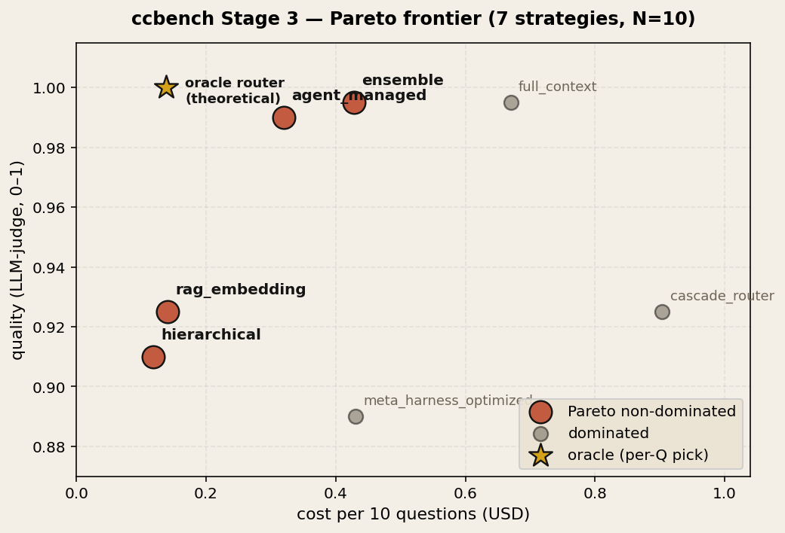
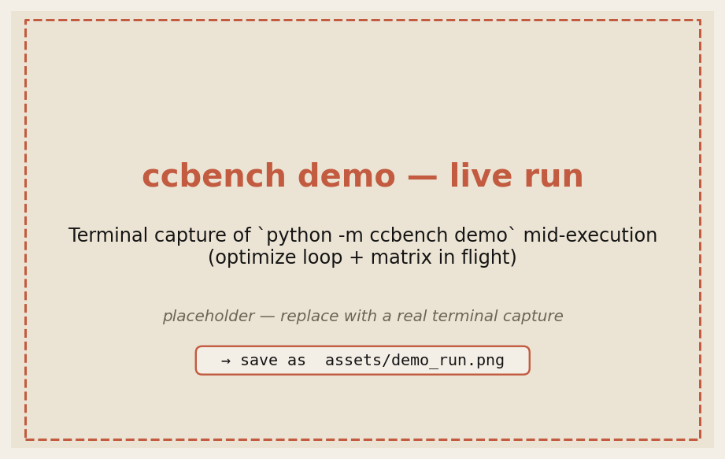
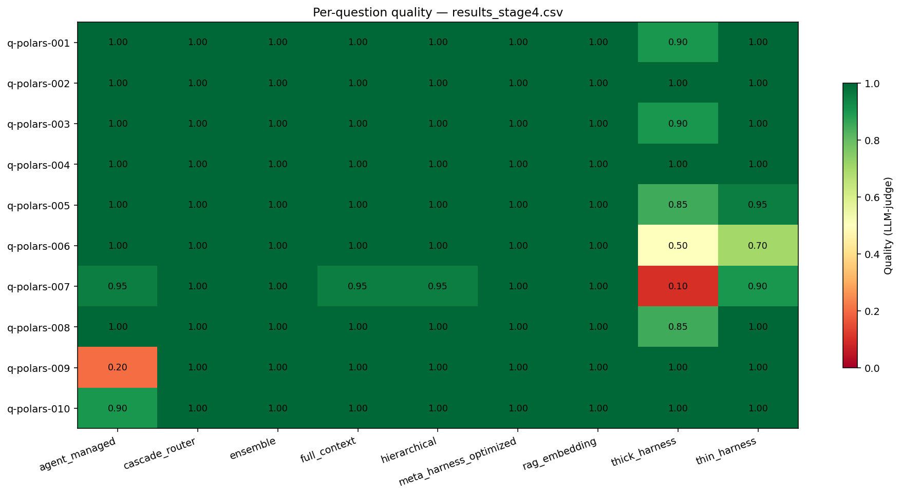

# ccbench — Context Curation Benchmark

[](https://github.com/yanhann10/context-curation-benchmark/actions/workflows/ci.yml)
[](https://www.python.org/)
[](LICENSE)
[](https://www.anthropic.com/)

A **contradiction-aware**, YAML-driven benchmark for 7 LLM context-curation strategies — full-context, RAG, hierarchical, agent-managed, cascade-router, ensemble, and meta-harness-optimized. The corpus is intentionally split into a **stale portal** (GitLab Handbook, timestamped 2026-01-01) and a **fresh chat layer** (HR-validated Slack threads); 40% of eval questions require overriding the stale value with the newer Slack value. Results are a **Pareto frontier** over (quality, cost, tokens) — not a single winner.

> **Headline** (N=10 HR-policy questions, Claude Sonnet 4.6) — an **oracle router** over the 7 strategies hits **1.000 quality at $0.138/10q**: ~**5× cheaper than stuffing the full context** ($0.670) at equal quality. Best deployed strategy is **ensemble** (0.995 quality at 64% of full-context cost). Full breakdown and failure modes: [Findings ↓](#findings-stage-3-7-strategies-claude-sonnet-46-throughout).



### Key numbers (N=10, Claude Sonnet 4.6)

| strategy | quality | cost / 10q | vs full-context | notes |
|---|---:|---:|---|---|
| **oracle router** (theoretical) | **1.000** | **$0.138** | **4.9× cheaper** | pick cheapest max-quality per Q; `hierarchical` wins 9/10 |
| **ensemble** (deployed) | **0.995** | **$0.428** | **1.6× cheaper** | parallel `hierarchical` + `agent_managed`, judge picks |
| agent_managed | 0.990 | $0.320 | 2.1× cheaper | best single strategy for quality/cost |
| hierarchical | 0.910 | **$0.118** | 5.7× cheaper | cheapest; 1 catastrophic miss on `needs_both` |
| full_context (baseline) | 0.995 | $0.670 | — | stuff everything; dominated by ensemble |
| cascade_router | 0.925 | $0.904 | 1.3× **more** | self-verifier fails — over-confident on wrong tier-1 |

Full 7-strategy table + per-category failure forensics: [Findings ↓](#findings-stage-3-7-strategies-claude-sonnet-46-throughout). Chart regeneration: `python scripts/render_frontier.py output/summary_stage3.json assets/frontier_stage3.png`.

## Quick start

```bash
python3 -m venv .venv
.venv/bin/pip install -r requirements.txt
cp .env.example .env          # edit ANTHROPIC_API_KEY
.venv/bin/python -m ccbench demo
```

`demo` runs the bundled HR-policy suite end-to-end (7 strategies × 10 questions, LLM-judged, plus the meta-harness optimize loop). ~2–3 min, artifacts in `output/`.

### What `demo` prints (abridged, real numbers from `output/summary_stage3.json`)

```text
suite=sample-data-hr-policy  corpus=21 docs  questions=10
strategies=['full_context','rag_embedding','hierarchical','agent_managed','cascade','ensemble','meta_harness']

[optimize] fitting 'meta_harness' on 4 questions, 3 iterations
[optimize] final spec: 11 static docs + 10 slack threads, order=by-slice

[matrix] running 7 × 10 cells
========================================================================
SUITE SUMMARY — sample-data-hr-policy
========================================================================
strategy                 quality    f1   tokens  cost_usd  latency
full_context               0.995 0.534   20231     0.670     6.59
rag_embedding              0.925 0.455    2459     0.141     6.75
hierarchical               0.910 0.491    1775     0.118     6.05
agent_managed              0.990 0.524    8142     0.320     8.95
cascade_router             0.925 0.546   24920     0.904    23.54
ensemble                   0.995 0.527   10219     0.428    11.34
meta_harness_optimized     0.890 0.467   12154     0.431     7.46

Pareto frontier over ['quality', 'cost_usd', 'total_tokens']:
  * hierarchical       <-- non-dominated (cheapest, fewest tokens)
  * agent_managed      <-- non-dominated (best single-strategy quality/cost)
  * ensemble           <-- non-dominated (max quality at 64% full-ctx cost)

Per-axis winners:
           quality: ensemble
          cost_usd: hierarchical
      total_tokens: hierarchical
```

### Live run (screenshots)

Drop your own terminal captures into `assets/` and they render here. Suggested shots:

| | |
|---|---|
|  |  |
| `python -m ccbench demo` — 7×10 matrix executing | Final Pareto frontier + per-axis winners |

_Replace the two `assets/demo_*.png` files with real captures; the layout above will re-render. A good pair is one shot of the in-flight progress (optimize loop + matrix) and one of the `SUITE SUMMARY` block at the end._

## Architecture

```mermaid
flowchart LR
  Y[suite.yaml] --> S[SuiteSpec]
  S --> C[CorpusSpec<br/>@corpus_loader]
  S --> D[Questions<br/>jsonl]
  S --> M[Strategy matrix<br/>@strategy]
  C --> R[runner.py<br/>async matrix]
  D --> R
  M --> R
  R --> G[grader<br/>@grader llm_judge]
  G --> U[summary.json]
  U --> F[frontier.json<br/>Pareto non-dominated]
  U --> O[optimize loop<br/>propose → eval → keep]
  O -.-> M
```

Four things ccbench does differently from a typical evals harness (shape borrowed from [letta-evals](https://github.com/letta-ai/letta-evals), novelties are ours):

1. **`strategies:` is a list** — a suite IS a matrix, not a single `target:`.
2. **`CorpusSpec` is first-class**, separate from dataset. Docs carry `kind` (static|fresh), `timestamp`, `freshness_priority`. Questions reference corpus slices by name.
3. **`frontier:` replaces `gate:`** — output is the Pareto non-dominated set over `(quality, cost, tokens)` plus per-axis winners, instead of a boolean threshold.
4. **`optimize:` is a built-in phase** — propose → evaluate → keep-best on a typed `CurationSpec` runs before final scoring.

## Add your own strategy

ccbench is a decorator-registry. A new strategy / corpus loader / grader is ~10 lines:

```python
from ccbench.registry import strategy

@strategy("keyword_filter")
async def keyword_filter(ctx, question, corpus, terms=None):
    picks = [d for d in corpus.docs if any(t in d.title.lower() for t in terms or [])]
    blob = "\n\n".join(f"# {d.title}\n{d.content}" for d in picks)
    return f"Context:\n{blob}\n\nQuestion: {question.input}"
```

Full walkthrough: [`docs/add_your_own.md`](docs/add_your_own.md). Minimal 3-doc / 2-question example: [`examples/toy/`](examples/toy/).

## Repo layout

```
ccbench/
├── cli.py              # python -m ccbench demo|run|validate|list-strategies
├── registry.py         # @strategy / @grader / @corpus_loader decorators
├── spec.py             # YAML → SuiteSpec
├── corpus.py           # CorpusSpec, Doc (kind/timestamp/freshness_priority)
├── dataset.py          # Question
├── runner.py           # async matrix + per-category summary
├── judge.py            # llm_judge grader
├── frontier.py         # Pareto report
├── optimizer.py        # built-in propose/eval/keep loop
└── strategies/         # full_context, rag_embedding, hierarchical, agent_managed, meta_harness
suites/sample_data_hr_policy.yaml
examples/toy/{corpus.jsonl,questions.jsonl,suite.yaml}
data/corpus.jsonl, questions.jsonl
```

Artifacts from any run: `output/{suite}_matrix.csv`, `{suite}_summary.json`, `{suite}_frontier.json`, `{suite}_optimizer_history.json`.

**Legacy scripts** (`legacy/main_stage2.py`, `legacy/main_stage3.py`, `main_stage4.py`) hard-code strategies and print stage-specific tables — kept for reproducibility of the historical stage runs. `main.py` is now a shim that points at `python -m ccbench demo`; `ccbench` makes the same pipeline a declarative suite, and the existing `src/` code is reused as strategy adapters — no rewrite.

## Thesis

"Just stuff the full context window" is the default assumption as windows expand. When the corpus mixes static policy docs (GitLab Handbook) with noisy fresh chat answers (Slack), does that default still win? And can a Meta-Harness-style proposer auto-discover a better curation strategy?

## Stage 1 scope (what's built)

- **Strategy A — Full Context**: concatenate every handbook section and every Slack thread into the prompt. Baseline.
- **Strategy B — Meta-Harness Optimized**: an LLM proposer iteratively mutates a typed `CurationSpec` (which docs, ordering, format, max-chars, instructions) on a train set of questions and keeps the best-scoring spec.

## Honest simplification from faithful Meta-Harness

Faithful Meta-Harness ([Stanford IRIS Lab](https://yoonholee.com/meta-harness/), [artifact](https://github.com/stanford-iris-lab/meta-harness-tbench2-artifact)) evolves **arbitrary Python harness code** using execution traces + filesystem. For a 2hr budget we:

- replace "mutate Python code" with "mutate a typed `CurationSpec` dataclass" — same loop (propose → execute → score → keep best), safer, interpretable
- use a single proposer LLM call per iteration instead of a population-based search
- train on a subset of the eval questions (no held-out split in MVP)

What we can legitimately claim: *"inspired by Meta-Harness; applies the propose/evaluate/keep loop to a structured curation spec rather than harness code."* Not a faithful reproduction. See `notes/meta_harness_analysis.md`.

## Repo layout

```
.
├── main.py                  # redirect shim → `python -m ccbench demo`
├── src/
│   ├── data_loader.py       # load handbook/*.md + slack.json + test_questions.json
│   ├── strategies.py        # full_context + meta_harness_optimized + CurationSpec
│   ├── evaluator.py         # agent call, LLM-as-judge, CSV logging
│   └── harness_optimizer.py # propose-mutate-score loop over CurationSpec
├── data/
│   ├── handbook/            # *.md extracted from handbook.gitlab.com
│   ├── slack.json           # synthetic Slack threads
│   └── test_questions.json  # 6 Qs w/ golden answers + category tags
├── output/                  # CSV + JSON artifacts from each run
├── eval/eval_runs.md        # append-only master log across runs
├── notes/
│   └── meta_harness_analysis.md
└── prd.md
```

## Setup

```bash
cd /Users/hanyan/git_repo/context-curation-benchmark
python3 -m venv .venv
.venv/bin/pip install -r requirements.txt
cp .env.example .env     # then edit ANTHROPIC_API_KEY
```

**LLM backend:** Claude (Anthropic SDK). Default models — agent = `claude-sonnet-4-6`, judge / proposer = `claude-opus-4-7`, summary / router = `claude-haiku-4-5`. Override via env.

**Embeddings:** local `BAAI/bge-small-en-v1.5` via `sentence-transformers` (Claude has no embedding endpoint). FAISS `IndexFlatIP` for retrieval.

## Run

```bash
# full pipeline: optimize spec on train qs, then eval both strategies on all qs
python3 main.py

# skip the proposer loop (use baseline spec for Strategy B)
python3 main.py --skip-optimize

# tune train size / iterations
python3 main.py --train 4 --iter 3
```

Artifacts in `output/`:
- `results_stage1.csv` — per-question × per-strategy row (quality, f1, EM, tokens, latency, cost)
- `optimizer_history.json` — every proposed spec + rationale + score
- `final_spec.json` — the winning `CurationSpec`
- `summary.json` — per-strategy aggregate means

## Metrics

| Metric | Range | Definition |
|---|---|---|
| quality | 0–1 | LLM-judge vs golden answer (recency-sensitive goldens penalized if agent returns stale handbook value) |
| f1 | 0–1 | SQuAD-style token F1 vs golden |
| exact_match | 0/1 | Normalized EM vs golden |
| key_fact_recall | 0–1 | Fraction of key_facts whose normalized form appears in answer |
| latency_s | float | Wall-clock seconds per agent call |
| prompt_tokens / completion_tokens | int | From Anthropic usage |
| cost_usd | float | Per-model priced, sum of agent + judge calls |

**Note:** a separate `recency` metric was tracked in Stage 1/2 but dropped in Stage 3 — all strategies hit `recency=1.0` at Sonnet 4.6 level, so it was table stakes. Recency handling is now rolled into `quality`: the judge penalizes stale answers on recency-sensitive questions.

## Question categories

- `portal_only` — answer purely in the handbook, Slack doesn't touch it
- `slack_contradicts` — handbook is stale, Slack is correct (tests recency handling)
- `slack_only` — info only in Slack, not in handbook
- `needs_both` — handbook gives policy, Slack gives a current detail

## Findings (Stage 3, 7 strategies, Claude Sonnet 4.6 throughout)

N=10 v2 HR onboarding questions (4 slack_contradicts, 2 slack_only, 2 needs_both, 2 portal_only). Corpus: 11 handbook docs (timestamped 2026-01-01) + 10 Slack-API-shape threads (HR-validated, recent). Full eval log in `eval/eval_runs.md`.

| strategy | quality | f1 | latency_s | prompt_tok | cost_usd |
|---|---|---|---|---|---|
| full_context | 0.995 | 0.534 | 6.6 | 19,957 | 0.670 |
| meta_harness_optimized | 0.890 | 0.467 | 7.5 | 11,863 | 0.431 |
| rag_embedding | 0.925 | 0.455 | 6.7 | 2,161 | **0.141** |
| hierarchical | 0.910 | 0.491 | 6.1 | **1,489** | **0.118** |
| agent_managed | 0.990 | 0.524 | 8.9 | 7,739 | 0.320 |
| cascade_router | 0.925 | 0.546 | 23.5 | 24,522 | 0.904 |
| **ensemble** | **0.995** | 0.527 | 11.3 | 9,817 | 0.428 |

**Oracle router** (pick cheapest max-quality per question): **1.000 quality at $0.138** — 3× cheaper than ensemble, 5× cheaper than full_context. Picks hierarchical 9/10, agent_managed 1/10.

Charts: `output/chart_stage3.png`, `output/chart_stage3_heatmap.png`.

### Per-category breakdown (the staleness axis)

Aggregate quality hides where each strategy actually fails. Splitting by question category:

| strategy | slack_contradicts (N=4) | slack_only (N=2) | needs_both (N=2) | portal_only (N=2) |
|---|---|---|---|---|
| full_context | 1.000 | 1.000 | 0.975 | 1.000 |
| meta_harness_optimized | 1.000 | 1.000 | 1.000 | **0.450** |
| rag_embedding | 1.000 | 1.000 | 0.975 | **0.650** |
| hierarchical | 1.000 | 1.000 | 1.000 | **0.550** |
| agent_managed | 1.000 | 1.000 | 0.950 | 1.000 |
| cascade_router | 0.988 | 1.000 | 1.000 | **0.650** |
| ensemble | 1.000 | 1.000 | 0.975 | 1.000 |

**Three readings:**

1. **Contradiction handling is saturated at Sonnet 4.6.** Every strategy hits 1.000 on `slack_contradicts`, including the cheapest (`hierarchical`, $0.013/Q). Recency-aware prompting is table stakes — the staleness axis is necessary corpus structure but no longer a discriminator at this model class. The discriminator has moved.
2. **The real bottleneck is retrieval recall, not freshness.** Every below-1.000 cell is a `portal_only` or `needs_both` question where a selective strategy dropped a handbook doc it needed — meta-harness overfit and excluded `us-benefits-overview`; RAG/hier missed `parental-and-other-leave`. Full-context and agent-managed (which can *see* the catalog and pull docs lazily) are the only strategies that never drop below 0.95.
3. **Ensemble ≈ agent_managed on category breakdown.** The 0.5pp aggregate gap (0.995 vs 0.990) is a single 0.95 on one `needs_both` question where the judge tied. Ensemble is variance-reduction insurance, not a quality lift.

### Headlines
- **Ensemble matches full_context quality at 64% the cost** — best demonstrated strategy at this model class.
- **Cascade routing is WORSE than its tier-2 alone** (0.925 at $0.90 vs agent_managed 0.990 at $0.32). LLM self-verification is over-confident on confidently-wrong tier-1 outputs.
- **Oracle-vs-ensemble gap is $0.29 / 10q** — a learned router or cross-model verifier that beats self-verification is the highest-leverage improvement.

### Per-strategy failure modes

- **full_context**: 0.995 — one 0.95 on q-v2-007 (needs_both); 2× the cost of agent_managed.
- **meta_harness_optimized**: drops q-v2-009 (portal_only STD benefits → **0.00**). Optimizer spec excluded `us-benefits-overview`. Train-set overfit is recurrent.
- **rag_embedding / hierarchical**: fail q-v2-010 (military leave: RAG 0.30, hier 0.10). Neither retrieves `parental-and-other-leave.md`.
- **agent_managed**: 0.990, 0.90 on q-v2-007 only.
- **cascade_router**: 0.30 on q-v2-010. **Self-verifier failure mode:** hier returned confidently-wrong, verifier said `confident: 1`, never escalated. Also pays all 3 tiers on ~8/10 questions because verifier over-eagerly fires on hedging/missing citations.
- **ensemble**: 0.95 on q-v2-007 — judge picked hier's answer when agent_managed's was also ~0.95; not a real failure.

### When to pick what

- **Max demonstrated quality** → `ensemble` (0.995 at $0.428)
- **Best single-strategy quality/cost** → `agent_managed` (0.990 at $0.320)
- **Cheapest with 1 catastrophic failure tolerance** → `hierarchical` ($0.118, but fails q-v2-010)
- **Avoid**: `cascade_router` as implemented — single-model self-verification defeats the purpose. Fix with a cross-model verifier.
- **Theoretical ceiling**: oracle router ($0.138, 1.000) — implementable with a learned router or cross-model verifier

Recency-handling: all strategies correctly prefer the recent Slack value on `slack_contradicts` questions. Recency is table stakes at Sonnet 4.6 and was dropped as a separate metric.

## Sources

- GitLab Handbook — https://handbook.gitlab.com/handbook/
- Meta-Harness concept — https://yoonholee.com/meta-harness/
- Meta-Harness artifact — https://github.com/stanford-iris-lab/meta-harness-tbench2-artifact

## Stage 2 (built — runs all 4 strategies)

```bash
python3 main_stage2.py                 # reuses output/final_spec.json from Stage 1
python3 main_stage2.py --reoptimize    # re-run the meta-harness proposer first
python3 main_stage2.py --rag-k 6 --hier-ids 5
```

Strategies compared:
- `full_context` — stuff all handbook + Slack into every prompt. No selection.
- `meta_harness_optimized` — apply a typed `CurationSpec` (which ids to include, ordering, format, max-chars, instructions) that an LLM proposer iteratively mutated against failure traces on a train subset.
- `rag_embedding` — chunk docs (~1200 chars, 200 overlap), embed via local `BAAI/bge-small-en-v1.5`, index in FAISS (`IndexFlatIP` on L2-normalized vectors = cosine), retrieve top-k per question. Classic RAG.
- `hierarchical` — **no embedding retrieval.** Two LLM passes: (1) *map* — summarize each doc to 1–2 sentences once, cache; (2) *route* — LLM sees question + catalog of `(id, title, timestamp, summary)` and returns JSON `{"doc_ids": [...]}` with 2–5 picks; (3) *expand* — the full text of the selected docs goes to the answerer. Trades retrieval speed for LLM reasoning over summaries.
- `agent_managed` — tool-use loop. The model is handed four tools (`list_handbook`, `get_handbook(doc_id)`, `list_slack`, `get_slack(thread_id)`) and a system prompt describing the corpus split (stale handbook dated 2026-01-01 vs recent HR-validated Slack). It runs up to 6 turns: typically `list_handbook` + `list_slack` first (sees titles + timestamps), then 1–3 `get_*` calls for the docs it judged relevant, then emits a final answer. Token usage is summed across **all** turns, so the reported cost reflects full loop spend.
- `cascade_router` — Tier 1 `hierarchical` → self-verifier (`{"confident": 0|1}`) → if 0, Tier 2 `agent_managed` → verifier again → if 0, Tier 3 `full_context`. Tokens summed across all tiers. **Finding: self-verification is the weak link** — see Findings below.
- `ensemble` — Runs `hierarchical` and `agent_managed` **in parallel** per question; judge-LLM picks A or B on correctness + specificity. Tokens additive.

Each strategy lives in its own module: `src/strategies.py` (full + meta-harness), `src/strategies_rag.py`, `src/strategies_hierarchical.py`, `src/strategies_agent_managed.py`, `src/strategies_cascade.py`, `src/strategies_ensemble.py`. All calls run async via `AsyncAnthropic` + `asyncio.gather` with staggered phases for rate-limit hygiene (5 base strategies concurrent → cascade → ensemble).

## Stage 3 / 4 (not built yet, per PRD)

- Stage 3: generate synthetic Slack-API-shaped updates with validated-more-recent facts; set original doc timestamps to 2026-01-01; benchmark token+accuracy across strategies.
- Stage 4: `ai4research` + [open-harness](https://github.com/MaxGfeller/open-harness) to auto-generate curation strategies.
