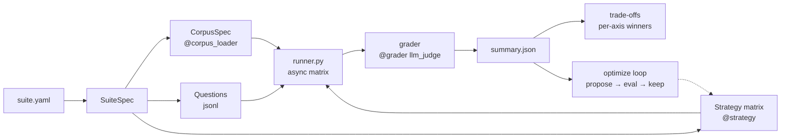

# xcbench: Context Curation Benchmark

[](https://github.com/yanhann10/context-curation-bench/actions/workflows/ci.yml)
[](https://www.python.org/)
[](LICENSE)

**xcbench** benchmarks LLM context-curation strategies — how to select, order, and format documents before handing them to an answering model. Strategies compared: `full_context`, `rag_embedding`, `hierarchical`, `agent_managed`, `cascade_router`, `ensemble`, `meta_harness_optimized`, `thin_harness`, `thick_harness`. Results are reported as a trade-off over quality, cost, and latency (single-seed, directional).

## Quick start

```bash
python3 -m venv .venv && source .venv/bin/activate
pip install -r requirements.txt
cp .env.example .env          # edit ANTHROPIC_API_KEY
python -m xcbench demo
```

`demo` runs the bundled HR-policy suite end-to-end. ~2–3 min, artifacts in `output/`.

## Tasks

Three domains plus one experimental sidecar. Each table normalizes latency and token cost to the cheapest strategy on that task (`× base`), so the "× base" column reads "how many times the base strategy's cost/latency." Base strategy varies by task.

### HR Policy

**Source:** [GitLab Handbook](https://handbook.gitlab.com/handbook/) pages (`data/handbook/`) plus owner-validated operational updates (synthetic Slack threads, `data/slack.json`). Tests single-source lookup, source-specific updates, multi-source synthesis, and resolved conflicts.

| strategy       | quality   | latency (× base) | token cost (× base) |
|----------------|----------:|-----------------:|--------------------:|
| full_context   | **0.927** | 1.2×             | 9.3×                |
| rag_embedding  | 0.888     | **1.0×** (base)  | **1.0×** (base)     |
| meta_harness   | 0.866     | 1.1×             | 5.4×                |
| agent_managed  | 0.823     | 2.5×             | 3.5×                |

**Runs:** N=108 questions, single seed. Failure-mode taxonomy: [`eval/forensics_hr.md`](eval/forensics_hr.md) — >50% of failures cluster on multi-doc synthesis where retrieval missed the second doc.

### Polars Docs

**Source:** [polars user guide](https://docs.pola.rs/) reference docs plus maintainer GitHub discussions. Tests migration questions (`groupby` → `group_by`), API renames, and maintainer arbitration over current names and patterns.

| strategy               | quality   | latency (× base) | token cost (× base) |
|------------------------|----------:|-----------------:|--------------------:|
| rag_embedding          | **1.000** | 0.88×            | 1.2×                |
| meta_harness_optimized | **1.000** | 0.76×            | 3.9×                |
| cascade_router         | **1.000** | 2.0×             | 2.1×                |
| ensemble               | **1.000** | 3.1×             | 3.1×                |
| full_context           | 0.995     | 0.61×            | 4.1×                |
| hierarchical           | 0.995     | **1.0×** (base)  | **1.0×** (base)     |
| thin_harness           | 0.955     | 1.8×             | 2.2×                |
| agent_managed          | 0.905     | 1.6×             | 2.1×                |
| thick_harness          | 0.810     | 4.0×             | 5.6×                |

**Runs:** N=10 questions, 9 strategies, single seed. Failure-mode taxonomy: [`eval/forensics_polars.md`](eval/forensics_polars.md).

### Flask Codebase

**Source:** [Flask 2.3 docs](https://flask.palletsprojects.com/en/2.3.x/) plus Flask 3.x maintainer discussions. Tests real breaking changes: removed APIs (`before_first_request`), replaced patterns, deprecated extensions.

**Runs:** suite defined at `suites/flask_codebase.yaml`; full matrix pending — not yet run at comparable scale. Run locally via `python -m xcbench run suites/flask_codebase.yaml`.

### ConflictQA (experimental sidecar)

**Source:** [kortukov/ConflictingQA](https://huggingface.co/datasets/kortukov/ConflictingQA) on Hugging Face — synthesis over genuinely conflicting real web sources. Useful for stress-testing synthesis behavior; no timestamp or authority signal available to resolve disagreements.

| strategy      | quality   | latency (× base) | token cost (× base) |
|---------------|----------:|-----------------:|--------------------:|
| full_context  | **0.876** | 0.79×            | 1.6×                |
| hierarchical  | 0.830     | **1.0×** (base)  | **1.0×** (base)     |

**Runs:** N=120 questions, 2 strategies — remaining 7 strategies pending. Experimental; synthesis-heavy behavior is still being characterized.

## Cross-domain probe: mle-bench harness ablation

Separate probe to test whether the xcbench harness ranking generalizes to code-generation tasks. Each harness produces a Python script that runs in the `mlebench-env` Docker container; a single revise-on-error round is allowed; the final `submission.csv` is graded via `mlebench grade-sample`.

| competition (metric, direction)             | full_context | rag_embedding | hierarchical | agent_managed |
|---------------------------------------------|-------------:|--------------:|-------------:|--------------:|
| spooky-author-identification (log loss ↓)   | 0.576        | 0.487         | **0.458**    | 0.486         |
| jigsaw-toxic-comment-classification (AUC ↑) | **0.971**    | 0.964         | 0.964        | 0.948         |

**Harness ranking is task-dependent.** On short-text 3-class author ID, less-context harnesses (hierarchical, RAG) beat full_context by 12 pp log loss. On long multi-label toxicity, full_context wins and agent_managed is last. None of the 8 cells hit Kaggle medals (bronze/silver/gold), consistent with first-pass code without HPO or ensembling.

**Runs:** N=2 competitions × 4 harnesses = 8 submissions, single seed.

Run yourself (Docker and Kaggle credentials required; see `mle_harness/README.md`):

```bash
AWS_REGION=us-east-1 python -m mle_harness.run_matrix \
  --comps spooky-author-identification,jigsaw-toxic-comment-classification-challenge \
  --harnesses full_context,rag_embedding,hierarchical,agent_managed \
  --out output/mle_matrix.csv
```

## Adaptive routing: viable on mixed-question tasks

On HR Policy (N=10), an **oracle router** that picks the cheapest max-quality strategy per question hits **1.000 quality at 1.2× hier cost** — roughly 3× cheaper than `ensemble` and 5× cheaper than `full_context`. The oracle picks `hierarchical` on 9/10 and `agent_managed` on 1/10. Same pattern on Polars: oracle at 1.000 quality at $0.135 total (cheapest strategy was $0.138 with one failure).

**Implication:** for mixed-question suites, a trained router over the question text could approach oracle cost while keeping quality. The current `cascade_router` approximates this via self-verification, but self-verification is the weak link (overconfident on confidently-wrong tier-1 outputs — the diagnosis is in the HR forensics doc). A cross-model verifier or a classifier trained on a few hundred labeled routings is a plausible next step.

See [`eval/forensics_hr.md`](eval/forensics_hr.md) for the per-question breakdown that makes this oracle finding explicit.

## Architecture



Four things xcbench does differently from a typical evals harness (shape borrowed from [letta-evals](https://github.com/letta-ai/letta-evals), novelties are ours):

1. **`strategies:` is a list** — a suite IS a matrix, not a single `target:`.
2. **`CorpusSpec` is first-class**, separate from dataset. Docs carry source metadata (`kind`, `timestamp`, `issuer`, `scope`). Questions carry adjudication metadata (`gold_status`, `canonical_source_ids`, `authority_rule_used`) without leaking that rationale into the judge prompt.
3. **`frontier:` replaces `gate:`** — output is per-axis winners over `(quality, cost, tokens)` plus a trade-off summary, instead of a boolean pass/fail threshold.
4. **`optimize:` is a built-in phase** — propose → evaluate → keep-best on a typed `CurationSpec` runs before final scoring.

## Add your own strategy

xcbench is a decorator-registry. A new strategy / corpus loader / grader is ~10 lines:

```python
from xcbench.registry import strategy

@strategy("keyword_filter")
async def keyword_filter(ctx, question, corpus, terms=None):
    picks = [d for d in corpus.docs if any(t in d.title.lower() for t in terms or [])]
    blob = "\n\n".join(f"# {d.title}\n{d.content}" for d in picks)
    return f"Context:\n{blob}\n\nQuestion: {question.input}"
```

Full walkthrough: [`docs/add_your_own.md`](docs/add_your_own.md). Minimal 3-doc / 2-question example: [`examples/toy/`](examples/toy/).

## Run

```bash
# bundled HR-policy suite end-to-end
python -m xcbench demo

# run any suite YAML
python -m xcbench run suites/sample_data_hr_policy.yaml
python -m xcbench run suites/polars_docs.yaml
python -m xcbench run suites/flask_codebase.yaml
python -m xcbench run suites/conflictqa.yaml --strategies full_context,rag_embedding,hierarchical --skip-optimize

# minimal 3-doc / 2-question example
python -m xcbench run examples/toy/suite.yaml
```

Artifacts in `output/` (per-suite prefixed):
- `{suite}_matrix.csv` — per-question × per-strategy row (quality, f1, EM, tokens, latency, cost)
- `{suite}_summary.json` — per-strategy aggregate means
- `{suite}_frontier.json` — Pareto non-dominated set + per-axis winners
- `{suite}_optimizer_history.json` — proposed spec + rationale + score per iteration

## Repo layout

```
xcbench/
├── cli.py              # python -m xcbench demo|run|validate|list-strategies
├── registry.py         # @strategy / @grader / @corpus_loader decorators
├── spec.py             # YAML → SuiteSpec
├── corpus.py           # CorpusSpec, Doc + source metadata
├── dataset.py          # Question
├── runner.py           # async matrix + per-category summary
├── judge.py            # llm_judge grader
├── frontier.py         # trade-off summary
├── optimizer.py        # built-in propose/eval/keep loop
└── strategies/         # full_context, rag_embedding, hierarchical, agent_managed, etc.
suites/{sample_data_hr_policy,polars_docs,flask_codebase,conflictqa}.yaml
data/{handbook,polars,flask,conflictqa}/
examples/toy/{corpus.jsonl,questions.jsonl,suite.yaml}
eval/{forensics_hr,forensics_polars,eval_runs}.md
```

## Metrics

| Metric | Range | Definition |
|---|---|---|
| quality | 0–1 | LLM-judge vs golden answer (or acceptable abstention behavior on ambiguous items when such labels exist) |
| f1 | 0–1 | SQuAD-style token F1 vs golden |
| exact_match | 0/1 | Normalized EM vs golden |
| key_fact_recall | 0–1 | Fraction of key_facts whose normalized form appears in answer |
| latency_s | float | Wall-clock seconds per agent call |
| prompt_tokens / completion_tokens | int | From Anthropic usage |
| cost_usd | float | Per-model priced, sum of agent + judge calls |

## Question categories

- `single_source` — one linked source is sufficient
- `source_only` — only a source-specific update thread answers the question
- `multi_source` — the answer requires synthesis across linked sources
- `scoped` — the correct answer is conditional on an explicit scope or version boundary
- `resolved_conflict` — linked sources disagree and the dataset carries explicit adjudication metadata for the winning resolution
- `abstain_required` — linked sources are insufficient or genuinely underdetermined, so the gold behavior is to say so

## Model configuration

```yaml
# any suite.yaml
models:
  agent: claude-opus-4-7       # answerer — dominant cost
  judge: claude-opus-4-7       # LLM-as-judge; override to claude-haiku-4-5 to differ from agent
  proposer: claude-opus-4-7    # meta-harness spec mutator
```

The runner warns if agent and judge are the same model (self-preference bias). Override the judge to `claude-haiku-4-5` to differ at the cost of weaker judgment, or override the agent to `claude-haiku-4-5` to push costs down at the cost of quality.

**Embeddings:** local `BAAI/bge-small-en-v1.5` via `sentence-transformers`. FAISS `IndexFlatIP` for retrieval.

## Strategies (with per-task observations)

- **`full_context`** — stuff every doc into the prompt. No selection.
  *Observation:* dominant on HR Policy (quality 0.927 vs next 0.888) where conflicts matter, but pays 9.3× base on tokens. On Polars it ties the rest at 0.995 — when retrieval is easy, full_context is just expensive.

- **`rag_embedding`** — chunk docs (~1200 chars, 200 overlap), embed via `BAAI/bge-small-en-v1.5`, index in FAISS (`IndexFlatIP` on L2-normalized vectors = cosine), retrieve top-k per question. Classic RAG.
  *Observation:* base on HR (cheapest and fastest), ties the frontier on Polars. Main failure mode: missing the second doc needed for multi-source synthesis. Fix candidates are adaptive-k or a reranker pass — see "Potentially worth testing" below.

- **`hierarchical`** — **no embedding retrieval.** Two LLM passes: (1) *map* — summarize each doc to 1–2 sentences once, cache; (2) *route* — LLM sees question + catalog of `(id, title, timestamp, summary)` and returns JSON `{"doc_ids": [...]}` with 2–5 picks; (3) *expand* — the full text of the selected docs goes to the answerer.
  *Observation:* Polars cost base at 0.995 quality. Fails when summaries lose the key term (q-v2-010 military-leave on HR).

- **`agent_managed`** — tool-use loop. The model gets four tools (`list_handbook`, `get_handbook(doc_id)`, `list_slack`, `get_slack(thread_id)`) and runs up to 6 turns. Token usage is summed across **all** turns, so the reported cost reflects full loop spend.
  *Observation:* strong when the right doc is not retrievable by embedding similarity (q-v2-009 STD benefits), but pays 2.1–3.5× base. Underperforms on Polars where the corpus is small enough that RAG rarely misses.

- **`cascade_router`** — Tier 1 `hierarchical` → self-verifier (`{"confident": 0|1}`) → if 0, Tier 2 `agent_managed` → verifier again → if 0, Tier 3 `full_context`. Tokens summed across all tiers.
  *Observation:* self-verifier over-fires (pays all tiers on most questions) AND misses true failures (confident on confidently-wrong hier output). Fix: cross-model verifier.

- **`ensemble`** — `hierarchical` and `agent_managed` in parallel per question; judge-LLM picks A or B on correctness + specificity. Tokens additive.
  *Observation:* ties top quality on Polars at 3.1× base cost. On HR matches full_context at ~64% its cost. Reliable but not cheap.

- **`meta_harness_optimized`** — applies a typed `CurationSpec` (which ids to include, ordering, format, max-chars, instructions) that an LLM proposer iteratively mutated against failure traces on a train subset. Simplification of Stanford IRIS's Meta-Harness (the faithful framework evolves arbitrary Python code; see [`notes/meta_harness_analysis.md`](notes/meta_harness_analysis.md)).
  *Observation:* ties the Polars frontier. On HR, the optimizer sometimes excludes a doc needed by a held-out question (train-set overfit). Small-N problem.

- **`thin_harness` / `thick_harness`** — ablation axis on how much tool-use / retries / verification the harness layer adds. Defined in the Polars and Flask suites.
  *Observation:* thin_harness 0.955 / 2.2× base; thick_harness 0.810 / 5.6× base on Polars. More harness machinery ≠ better quality; on this task it hurts.

## Potentially worth testing next

From a 2024–2026 literature pass, ranked by cheapest-to-implement that would diagnose a known xcbench weakness. Each is distinct from the 9 above.

1. **Reranker-Augmented RAG** — over-retrieve `k=40` with `bge-small`, then cross-encoder rerank to top-6 via [`BAAI/bge-reranker-v2-m3`](https://huggingface.co/BAAI/bge-reranker-v2-m3). Cheapest test of whether `rag_embedding`'s HR-failure (missing the second doc) is reranker-limited. ~50 LOC.
2. **Contextual Retrieval** ([Anthropic, Sep 2024](https://www.anthropic.com/news/contextual-retrieval)) — prepend an LLM-generated 50–100 token chunk-context blurb before embedding and BM25. 35%/49% retrieval-failure reduction in the original post. Targets Polars/Flask where chunks lose parent-scope. ~100 LOC.
3. **Adaptive-RAG** ([Jeong et al., NAACL 2024, arXiv:2403.14403](https://arxiv.org/abs/2403.14403)) — T5-Large classifier routes `{no-retrieve, single-step, multi-step}` per query on auto-derived labels. Canonical learned-router paper; directly replaces hand-coded cascade escalation. Repo: [starsuzi/Adaptive-RAG](https://github.com/starsuzi/Adaptive-RAG). ~150 LOC.
4. **RAPTOR** ([Sarthi et al., ICLR 2024, arXiv:2401.18059](https://arxiv.org/abs/2401.18059)) — recursive GMM-cluster + summarize chunks into a multi-level tree; retrieve at any level. Real upgrade to the single-level `hierarchical`. ~200 LOC.
5. **LongLLMLingua / LLMLingua-2** ([arXiv:2310.06839](https://arxiv.org/abs/2310.06839), [arXiv:2403.12968](https://arxiv.org/abs/2403.12968)) — token-importance classifier drops low-score tokens conditioned on the query. Reshapes `full_context`'s Pareto frontier rather than replacing it. ~70 LOC.
6. **GraphRAG** ([Microsoft, arXiv:2404.16130](https://arxiv.org/abs/2404.16130)) / **LightRAG** ([HKU, arXiv:2410.05779](https://arxiv.org/abs/2410.05779)) — entity KG + community summaries. Handles query-focused summarization ("what are the main themes of…") which none of the 9 strategies above do well. ~150–200 LOC.
7. **CRAG — Corrective RAG** ([Yan et al., arXiv:2401.15884](https://arxiv.org/abs/2401.15884)) — T5 retrieval *evaluator* (not the LLM itself) grades retrievals and triggers web-fallback or decompose. Sidesteps the `cascade_router` self-verification pathology. ~120 LOC.
8. **HyDE** ([Gao et al., ACL 2023, arXiv:2212.10496](https://arxiv.org/abs/2212.10496)) — LLM drafts a fake answer; embed the answer, not the query. Likely helps on HR ("what's our policy on…") and hurts on Polars (hallucinated API names mislead retrieval). ~30 LOC.
9. **Self-RAG** ([Asai et al., ICLR 2024, arXiv:2310.11511](https://arxiv.org/abs/2310.11511)) — model emits `[Retrieve] / [IsRel] / [IsSup] / [IsUse]` reflection tokens; retrieval gated per sentence. Differs from `agent_managed` in granularity. Pretrained 7B/13B checkpoints exist. ~100 LOC.

**On learned per-query routing**, three recent papers directly study it: Adaptive-RAG (above), [RAGRouter / RAGRouter-Bench (arXiv:2505.23052)](https://arxiv.org/abs/2505.23052), and [RouteRAG (arXiv:2506.15862)](https://arxiv.org/abs/2506.15862). All report that per-query routing beats fixed-strategy baselines on heterogeneous question sets — which matches xcbench's oracle-router observation above.

## References & upstream codebases

- **Meta-Harness** (Stanford IRIS Lab, 2026) — search over harness code via an LLM proposer. Paper: https://yoonholee.com/meta-harness/. Framework: https://github.com/stanford-iris-lab/meta-harness. Final tbench2 artifact: https://github.com/stanford-iris-lab/meta-harness-tbench2-artifact.
- **letta-evals** — evals harness shape that inspired xcbench's strategy-matrix suite format. https://github.com/letta-ai/letta-evals.
- **mle-bench** — OpenAI ML-engineering benchmark used for the cross-domain probe. https://github.com/openai/mle-bench.
- **GitLab Handbook** — source corpus for HR Policy suite. https://handbook.gitlab.com/handbook/.
- **Polars user guide** — source corpus for Polars Docs suite. https://docs.pola.rs/.
- **Flask docs** — source corpus for Flask Codebase suite. https://flask.palletsprojects.com/.
- **ConflictingQA** (kortukov, Hugging Face) — source dataset for ConflictQA sidecar. https://huggingface.co/datasets/kortukov/ConflictingQA.
